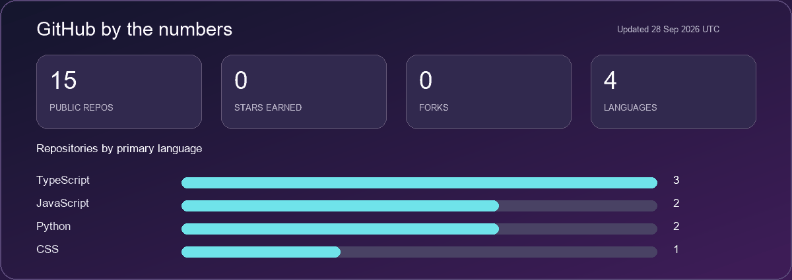

<div align="center">


<h1>Hey, I'm Aryan 👋</h1>

<p><strong>Building useful things across full-stack development, AI, and data.</strong></p>

<p>
  <a href="https://github.com/AryanSingh-07?tab=repositories">Explore my projects</a> ·
  <a href="https://github.com/AryanSingh-07/aryan_portfolio">Portfolio project</a>
</p>

</div>

## ✨ About me

I enjoy turning ideas into working software. My repositories span environmental intelligence, AI-powered tools, finance, and web development.

```text
CURRENT FOCUS  →  Full-stack products + practical AI
I BUILD        →  Web apps, data tools, and useful experiments
ON GITHUB      →  github.com/AryanSingh-07
```

## 🛠️ Technologies in my projects

`TypeScript` `JavaScript` `Python` `React` `Vite` `FastAPI` `PostgreSQL` `PostGIS`

## 📊 GitHub statistics

<div align="center">




</div>

## 🚀 Selected work

| Project | What it explores | Stack |
| --- | --- | --- |
| [Darukaa.Earth](https://github.com/AryanSingh-07/Darukaa.Earth-Full-Stack-Website) | Environmental restoration project tracking, geospatial maps, and carbon and biodiversity analytics | React · TypeScript · FastAPI · PostgreSQL/PostGIS |
| [RAG-based AI Teaching Assistant](https://github.com/AryanSingh-07/RAG-BASED-AI-TEACHING-ASSISTANT) | An AI teaching assistant built around retrieval-augmented generation | Python |
| [Credit Flow](https://github.com/AryanSingh-07/Credit-Flow---A-credit-Cibil-Score-Prediction-) | Credit score prediction project | Python |
| [Bitflow](https://github.com/AryanSingh-07/bitflow) | A TypeScript project from my recent work | TypeScript |

<div align="center">

### Thanks for stopping by ✨

<a href="https://github.com/AryanSingh-07?tab=repositories">See all repositories →</a>

</div>
